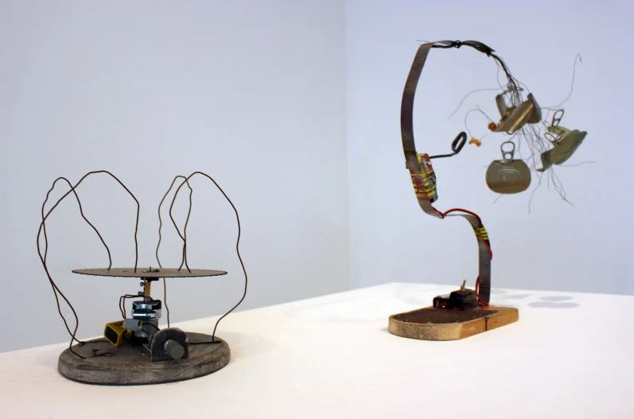
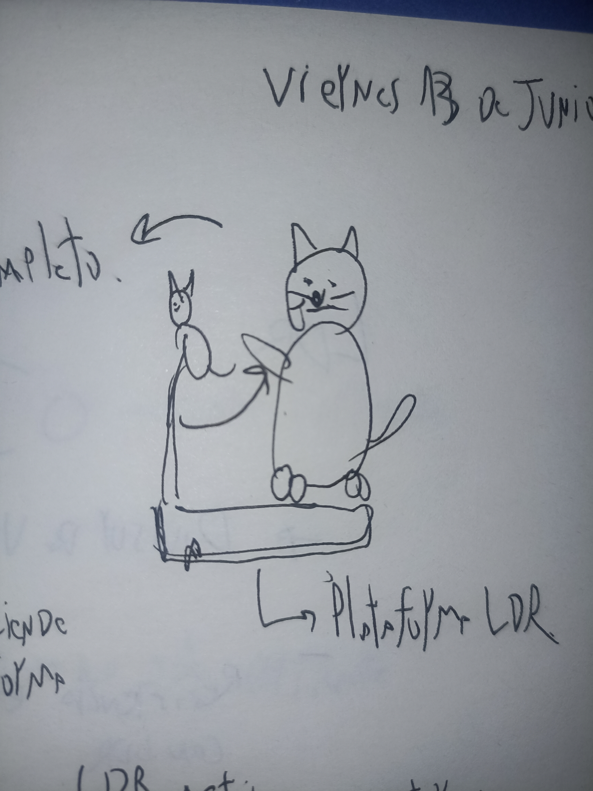

# examen

grupo-04

## integrantes
- Braulio Figueroa
- Carlo Martínez
- Bastian Solís

## proyecto-02

aprendizajes: 

dificultades

## premisa e idea de proyecto

El proyecto se centra en la idea de un juguete para gatos que se encuentren solos la mayor parte del tiempo, que tengan espacios de juego poco recreativos y necesiten algo para poder entretenerse de una manera más independiente. Es por ello que se llegó a la conclusión de que tenía que ser un objeto que se mueva solo, de una forma suficientemente autónoma para que el gato pueda jugar con la menor intervención humana posible. Para esto se ideó que debíamos usar alguna especie de motor que nos diera movimiento sobre el juguete y también algún sensor que detectara la presencia del gato, en este caso un sensor LDR. El proyecto mezcla aspectos de un circuito detector de sombra y por otra parte una variación de un circuito pwm.

### primeros bocetos y referentes

**Petr Válek**

Petr Válek - Kinetic

Lo que se busca es que el gato al subir a la plataforma, el sensor LDR detecte sombra y active el motor para que se mueva el juguete de forma automática, para ello el proyecto fue estudiado y se basó en el siguiente esquemático

## esquemático

Para entender el circuito y explicarlo, debemos separarlo en 3 partes las cuáles son

## protoboard

## PCB

## soldadura

## carcasa

## montaje

