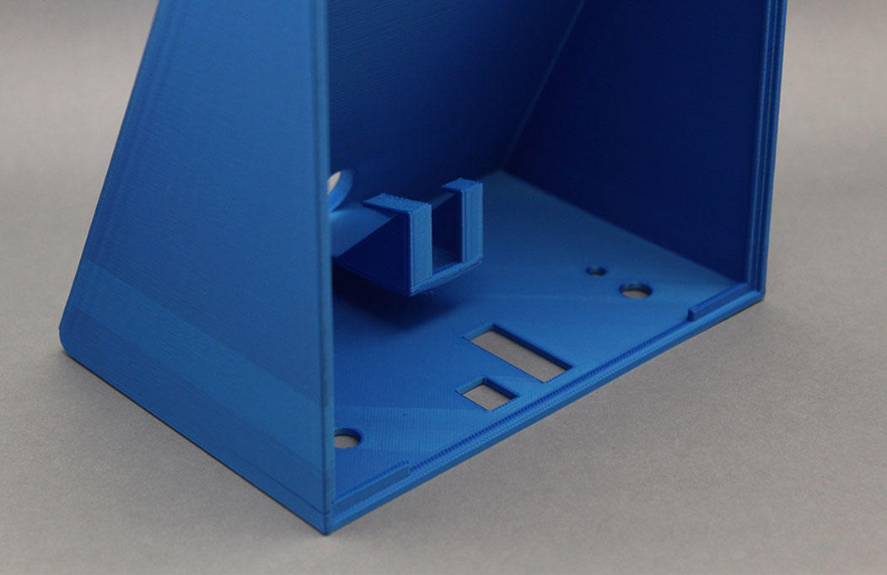
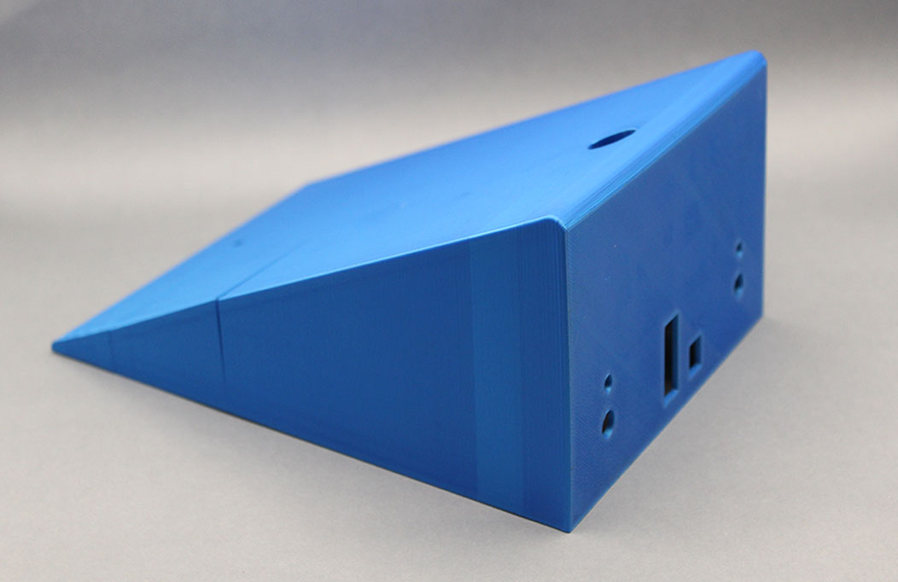
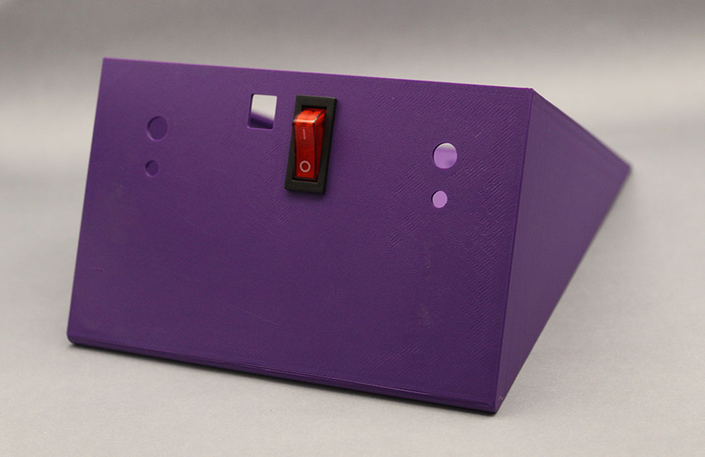

# examen

grupo-04

## Integrantes

- [Braulio Figueroa](https://github.com/brauliofigueroa2001)
- [Carlo Martínez](https://github.com/zaaaiko)
- [Bastian Solís](https://github.com/HSB25)

## proyecto-02

aprendizajes:

dificultades:

## Descripción del proyecto

El proyecto Meowtech es un juguete interactivo para gatos que se encuentran solos la mayor parte del tiempo, que tengan espacios de juego poco recreativos y necesiten un dispositivo para entretención de forma independiente y autónoma.

Es por ello que se llegó a la conclusión de que tenía que ser un objeto que se mueva solo, de una forma suficientemente autónoma para que el gato pueda jugar con la menor intervención humana posible. Para esto se ideó que debíamos usar alguna especie de motor que nos diera movimiento sobre el juguete y también algún sensor que detectara la presencia del gato, en este caso un sensor LDR. El proyecto mezcla aspectos de un circuito detector de sombra y por otra parte una variación de un circuito pwm.

### primeros bocetos y referentes

Petr Válek - Kinetic

Lo que se busca es que **al subir el gato a la plataforma, un sensor LDR detecte sombra y active el motor para que se mueva el juguete de forma automática**, para ello el proyecto fue estudiado y se basó en el siguiente esquemático.

## Esquemático

El circuito electrónico del proyecto tiene los siguientes componentes principales:

- Detector de sombra
  - Divisor de voltaje
  - Comparador de voltaje
- Controlador de motor
  - Chip 555 en modo astable
  - Transistor como interruptor
  - Motorreductor

### Detector de sombra

El detector de sombra tiene como entrada un sensor LDR, que es un resistor variable según la luz que detecta. Este LDR es uno de los dos resistores en un circuito divisor de voltaje.

Este divisor de voltaje es luego alimentado como entrada a un circuito comparador de voltaje. Este circuito está implementado con un amplificador operacional LM324, que compara el voltaje asociado a luz/sombra contra un umbral, que definimos con un potenciómetro para poder afinar el circuito.

Como refuerzo visual al funcionamiento del circuito, usamos un LED en paralelo que muestra si el comparador detecta o no sombra.

AGREGAR FOTOS DE ESQUEMATICO, DE DETALLE DE PROTOBOARD, Y DE DETALLE DE PCB.

### Controlador de motor

La salida del amplificador operacional LM324 en su pin 1 es alimentada como entrada al pin 4 de un chip 555, configurado en modo astable.

La salida del chip 555 es la que controla si debemos o no mover el motor. Como esta señal de control no es suficiente para mover el motor del circuito, usamos un transistor conectado como interruptor controlado por voltaje, que regula el paso o la ausencia de energía alimentada al motor al final de la cadena.

AGREGAR FOTOS DE ESQUEMATICO, DE DETALLE DE PROTOBOARD, Y DE DETALLE DE PCB.

## Protoboard

El desarrollo de la protoboard es el primer paso para que nuestro circuito sea probado y verifiquemos que todo funcione de la manera en la cuál propusimos. 

Debido a que el esquemático en el cuál está basado la protoboard contiene muchos componentes, decidimos que la forma más ordenada y clara de trabajarlo era con dos protoboard conectadas entre sí para que de esta forma se entendiera mucho mejor el circuito y no diera problemas estéticos ni de espacio.

## PCB

## Soldadura

## Carcasa

Durante el desarrollo del proyecto, la carcasa fue impresa en el laboratorio, diseñado, impreso y supervisado por Alanis Vasquez, del grupo 0a. Se utilizo una impresora 3D, modelo Bambu Lab X1C, usando un filamento PLA de 1.75 mm. Para el diseño en un pricnipio, se habia seleccionado un color azul (Ver imagenes 1-2), que va a juego con la placa, pero debido a problemas con la calidad de este post impresion, se decidio cambiar a un filamento de color morado para reimprimir la base, la carcasa , el logo y los soportes para la madera (Ver imagen 3).

Una vez finalizado el proceso de impresion, se verifico que la carcasa cerrara correctamente antes de colocar el modulo electronico. 

Imagen 1: 

Imagen 2: 

Imagen 3: 

## Montaje

El montaje se realizo insertando el PCB con su previo cableado y organizacion de estos, pegado de conectores, leds y potenciometro a la carcasa. Se coloca la PCB sobre soportes impresos previamente directo en la base. La fijacion se hizo con tornillos, y luego se coloco la tapa, mediante encaje con una pequeña ranura al lado para el retiro de esta, para luego pegar el logotipo a la parte superior. Una vez hecho esto, se une el palo de maqueta con el juguete al motor, mediante los soportes hechos en impresion 3D, para que este quede ajustado de forma correcta. Para finalizar, se comprobo que todos los accesos importantes (como el jack, potenciometros y switch) quedaran de forma correcta.

El resultado final fue una carcasa totalmente funcional. bien ajustada y visualmente adecuada, la cual permite proteger el circuito electronico y presentar tanto su manipulacion como su presentacion.

