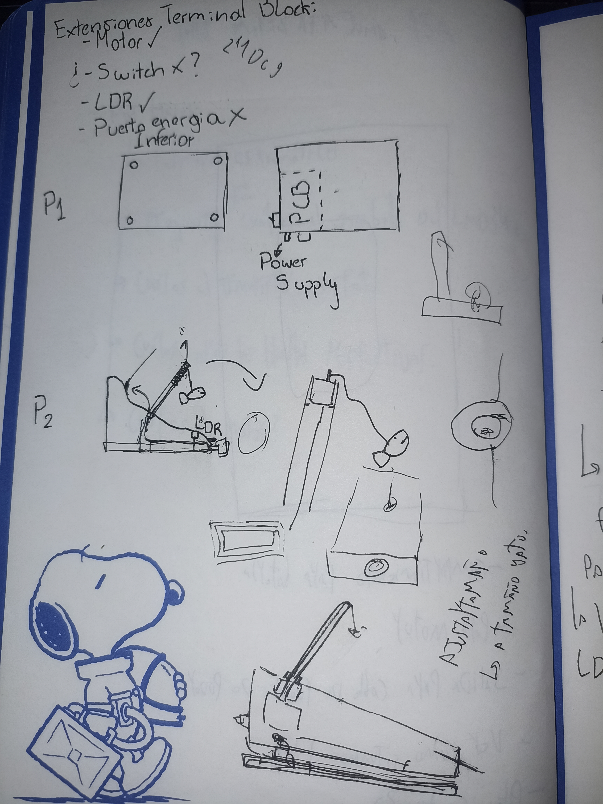

# examen

grupo-04

## integrantes

- [Braulio Figueroa](https://github.com/brauliofigueroa2001)
- [Carlo Martínez](https://github.com/zaaaiko)
- [Bastian Solís](https://github.com/HSB25)

## proyecto-02

aprendizajes: 

dificultades: 

## premisa e idea de proyecto

El proyecto Meowtech se centra en la idea de un juguete para gatos que se encuentren solos la mayor parte del tiempo, que tengan espacios de juego poco recreativos y necesiten algo para poder entretenerse de una manera más independiente. Es por ello que se llegó a la conclusión de que tenía que ser un objeto que se mueva solo, de una forma suficientemente autónoma para que el gato pueda jugar con la menor intervención humana posible. Para esto se ideó que debíamos usar alguna especie de motor que nos diera movimiento sobre el juguete y también algún sensor que detectara la presencia del gato, en este caso un sensor LDR. El proyecto mezcla aspectos de un circuito detector de sombra y por otra parte una variación de un circuito pwm.

### primeros bocetos y referentes

Petr Válek - Kinetic

Lo que se busca es que **al subir el gato a la plataforma, un sensor LDR detecte sombra y active el motor para que se mueva el juguete de forma automática**, para ello el proyecto fue estudiado y se basó en el siguiente esquemático:

## esquemático

El circuito se compone de 3 fases principales, en primer lugar está la fase de sombra. Esta fase funciona en base a un divisor de voltaje entre un LDR, una resistencia  y un chip lm324 que está funcionando como un comparador de voltaje. También posee un potenciómetro que sirve como un regulador del umbral de luz (lo que está acá adelante planeo decirlo y no escribirlo acá: "es decir, si lo llevamos al plano físico, al regular el umbral específico mediante el potenciómetro en base al nivel de luz del ambiente, si damos sombra al LDR este hará que el led que nos indica el umbral se encienda, en el caso contrario, si exhibimos el LDR a la luz, el led se apaga"). La salida del lm324 pin 1 positivo, está conectada a el pin 4 del chip 555, de esta forma funciona en modo astable ya que el pin 4 activa el reset. Este chip 555 está conectado a un potenciómetro que regula la velocidad del motor, la salida del 555 pin 3 no posee la suficiente energía para hacer funcionar el motor, es por ello que utilizamos un transistor mosfet que funciona como un amplificador de (voltaje, amperes?,duda de como decirlo) y permite que el motor pueda encenderse.
 

## protoboard

## PCB

## soldadura

## carcasa

## montaje
