# examen

grupo-05

## integrantes
  - Antonia Cristi [@antocristi](https://github.com/antocristi)
  - Natalia Pilar [@sz-mada](https://github.com/sz-mada)
  - Paulina Vargas [@paulinavargasf](https://github.com/paulinavargasf)

## proyecto-02

### aprendizajes

El mayor aprendizaje que obtuvimos durante el proyecto fue la importancia de pedir ayuda a personas externas al equipo. Al principio intentamos resolver todo solos, pero nos dimos cuenta que consultando con los docentes o gente de otros grupos, podíamos tener nuevas soluciones que nunca habríamos pensado. Si bien no logramos solucionar el principal problema que tuvimos durante todo el proyecto, el pedir ayuda nos permitió entender mejor la raíz de este error.

También aprendimos a organizarnos mejor dividiendo la carga en estaciones de trabajo, lo cual fue muy útil para optimizar el tiempo, ya que cada uno podía concentrarse en algo específico, y así como equipo avanzábamos en paralelo en vez de esperar a que alguien terminara de hacer lo suyo para que el resto siguiera trabajando.

### dificultades

Una de las principales dificultades fue que el circuito de la ruleta no funcionaba como habíamos planeado. Cuando montamos todos los componentes en la placa, al probarlo notamos que no respondía como debía. Revisamos varias veces los componentes para asegurarnos de no haber echo nada mal, pero no logramos encontrar el problema.

Otro problema constante fueron los cables de los componentes colgantes, que se cortaban con facilidad justo en la unión con la placa. Esto nos generó muchos retrasos ya que tuvimos que volver a soldar varias veces y reforzar las conexiones, lo cual también aumentaba el riesgo de dañar otros componentes en la placa.

Además, tuvimos un descuido **muy** importante: se nos olvidó retirar un chip antes de soldar cerca, así que se quemó. Por suerte, pudimos descubrir el error a tiempo.

Tuvimos un problema con el LDR, ya que el circuito no estaba recibiendo su señal como se esperaba. Aún después de revisar el componente y las conexiones, el sensor seguía sin responder correctamente, lo cual fue una de las dificultades que no logramos solucionar completamente.

Con ayuda de [FranUDP](https://github.com/FranUDP) y Aarón pudimos descubrir el error principal que estaba afectando el circuito. Nos hicieron notar que no teníamos el chip LM324 conectado a la alimentación, lo que explica por qué el circuito no funcionaba desde el inicio. Aarón nos sugirió una posible solución, conectar externamente los pines 4 y 11 del chip a la fuente de alimentación de la placa. Tristemente, aún después de probar esto, el circuito siguió sin funcionar correctamente. No sabemos si este problema era la única causa o si habían otros errores adicionales en la placa, pero sin dudarlo, podemos decir que fue el problema principal que nos retuvo durante la gran parte del proyecto.

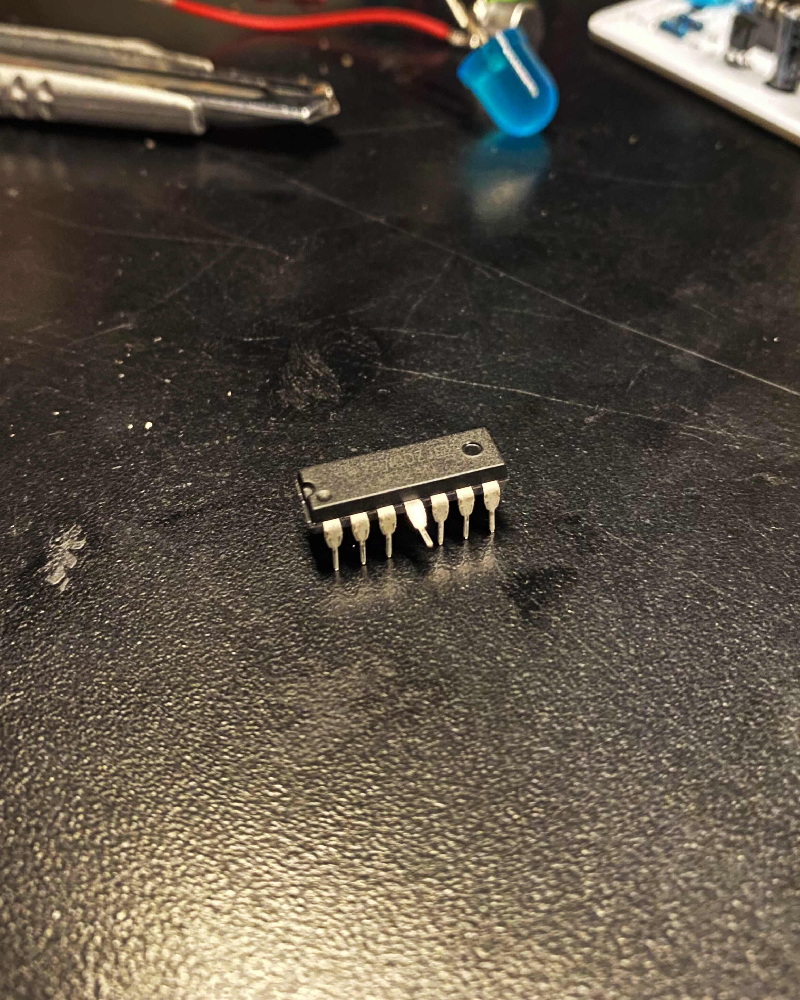

## PCB

El proyecto consiste en dos circuitos paralelos con sus respectivas PCBs; el primer circuito consiste en un detector de sombra que, por medio de un LDR, activa una secuencia de 10 pasos de LEDs, y el segundo es un micrófono electret que enciende una luz LED por medio del input de sonido. Estos circuitos **no** están relacionados en funcionalidad; el circuito del micrófono solo es un truco para el usuario.

Imágenes de las protoboards de prototipado

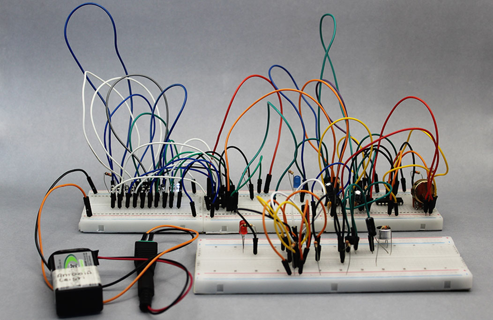

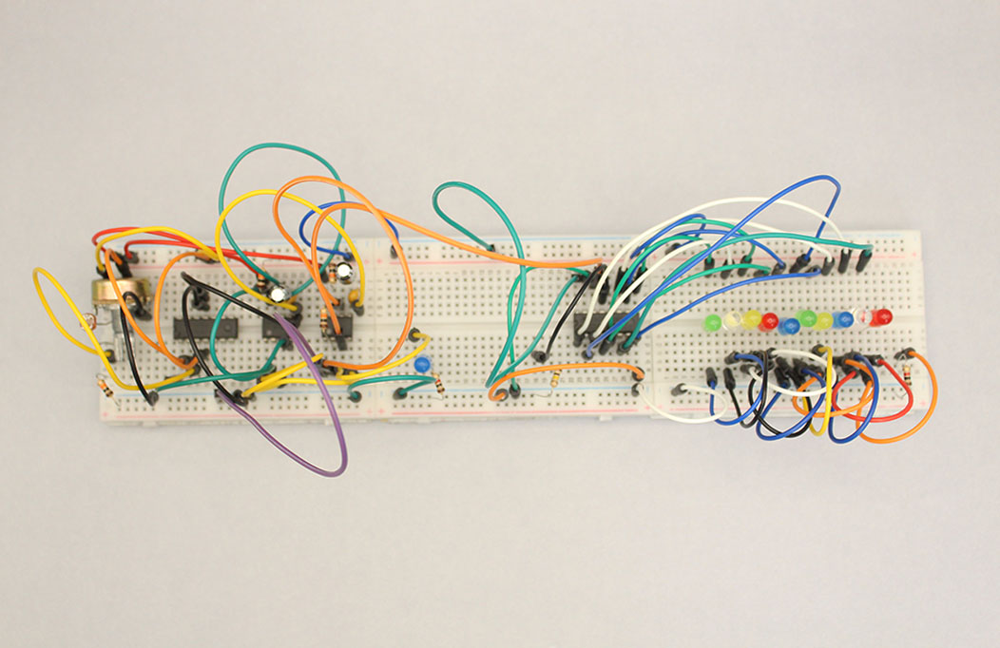

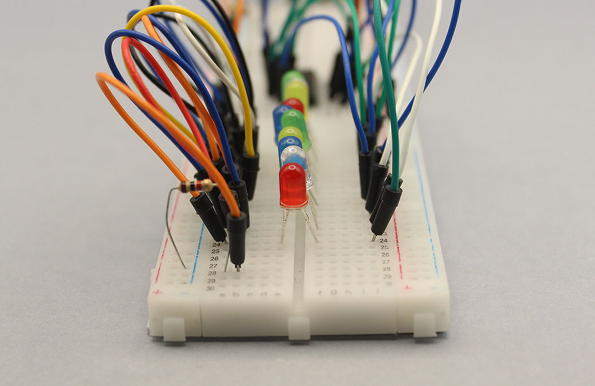

Imágenes de las placas PCB

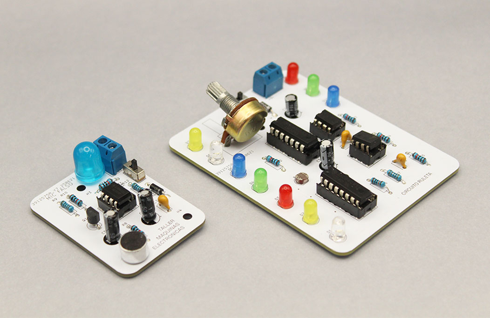

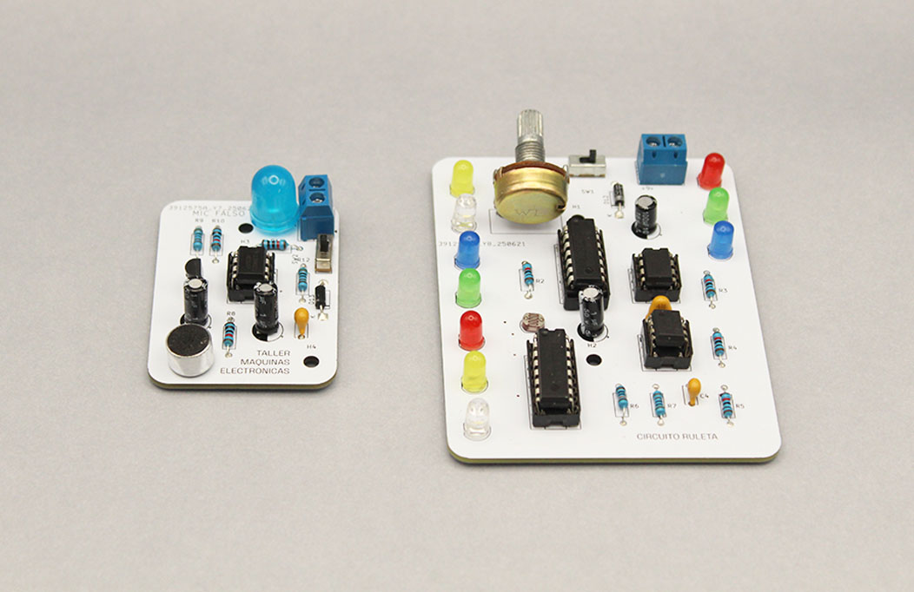

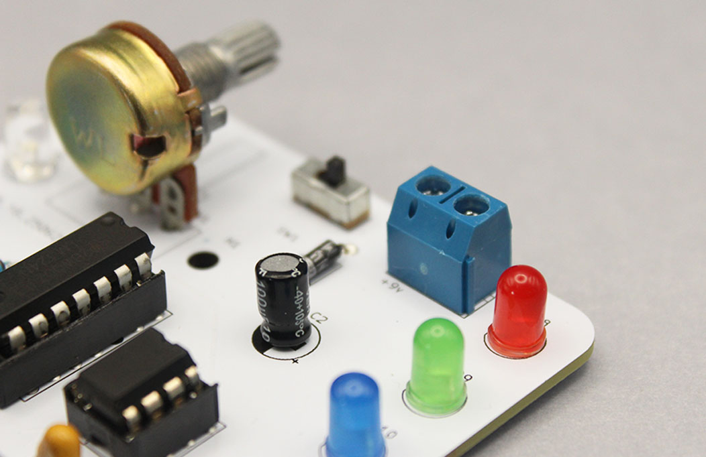

## soldadura

Decidimos soldar las placas a lo largo de distintos días.

Inicialmente, soldamos una de cada placa con todos los componentes directo en estas para asegurarnos que todo funcionara como debía.

Luego, en las otras placas, soldamos cables hacia los LEDs y el LDR para poder montarlos en la carcasa, pero tuvimos problemas ya que estos cables tendían a cortarse muy fácilmente.

Finalmente, luego de terminar de soldar y arreglar los cables cortados, montamos las placas correspondientes a la carcasa.

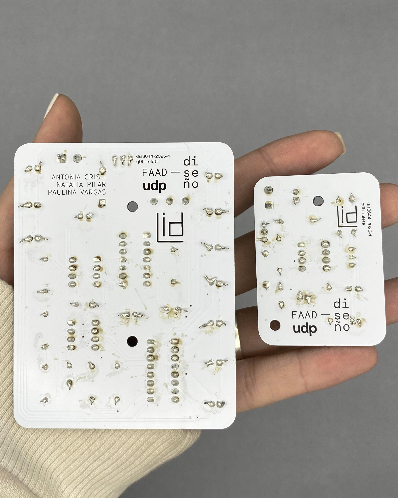

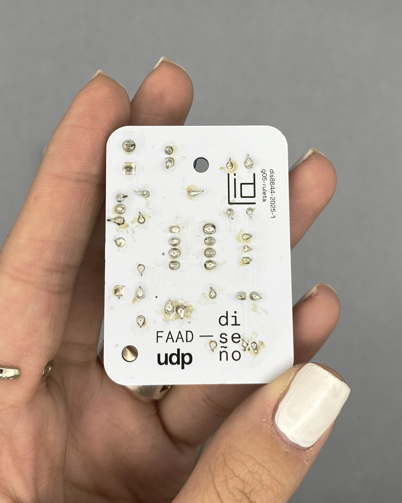

## carcasa

La carcasa se construyó en dos partes: una tapa hecha en corte láser con terciado de 3mm, y el contendor en impresión 3D.

Las luces LED de la ruleta se colocaron en la parte superior de la tapa en forma de arco, y el LDR fue situado en el centro para ser accesible al usuario.

Antes de cortar la tapa, decidimos agregar un diseño inspirado por una de las cartas del tarot, la rueda de la fortuna, con el centro de esta rueda alineándose con el posicionamiento del LDR.

Imágenes de la carcasa

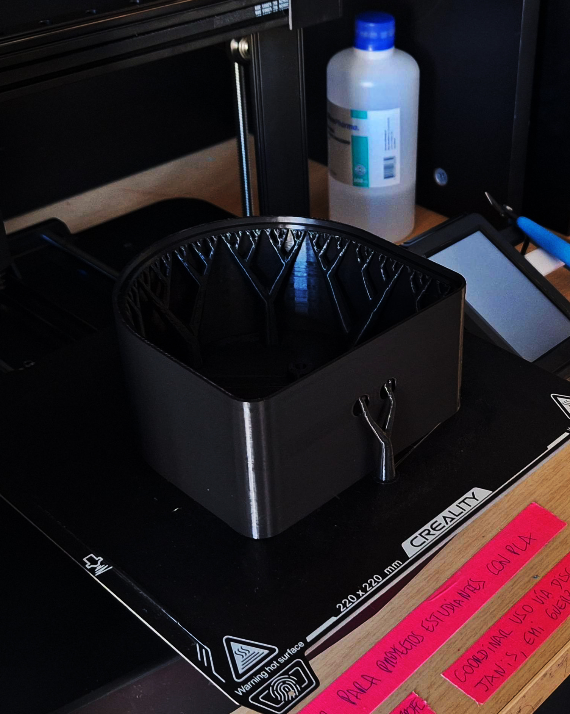

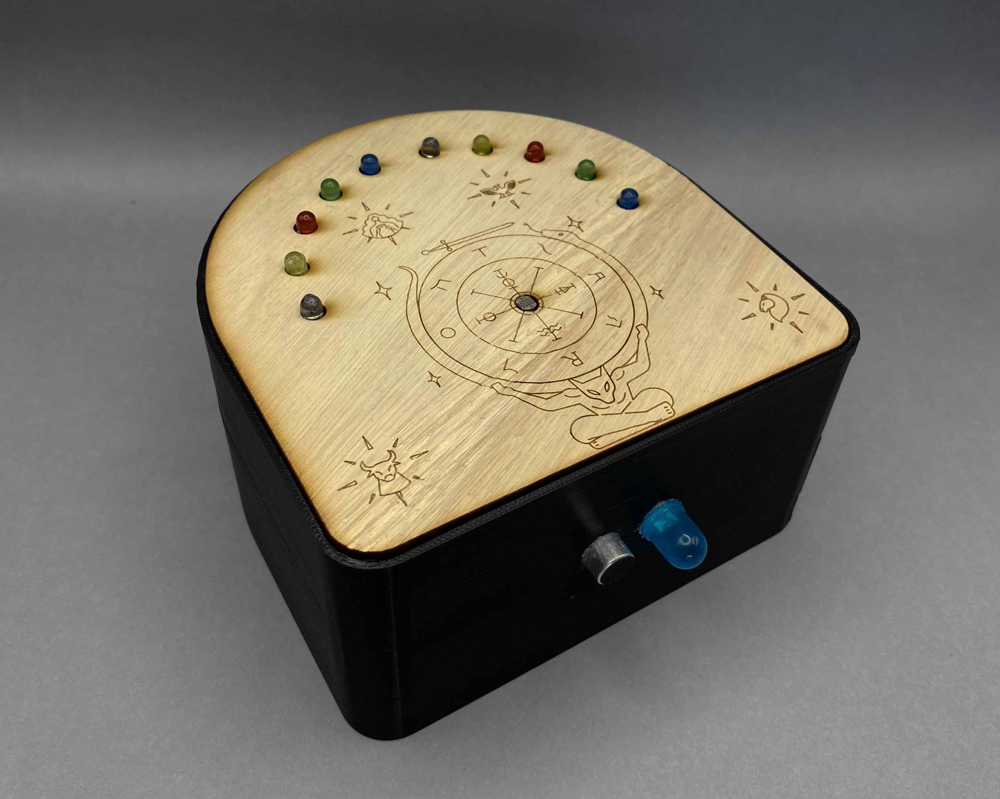

## montaje

Para el montaje, decidimos que la mejor manera de exponer nuestro proyecto sería comenzando con el "producto" final a la izquierda (el proyecto montado con la carcasa), llevando al prototipo inicial en la derecha (las protoboards).

El orden de las placas PCBs desde abajo hacia arriba es: placa vacía &rarr; placa con componentes soldados directamente en esta &rarr; placa con componentes soldados en cables para montaje en la carcasa &rarr; placas de intentos fallidos

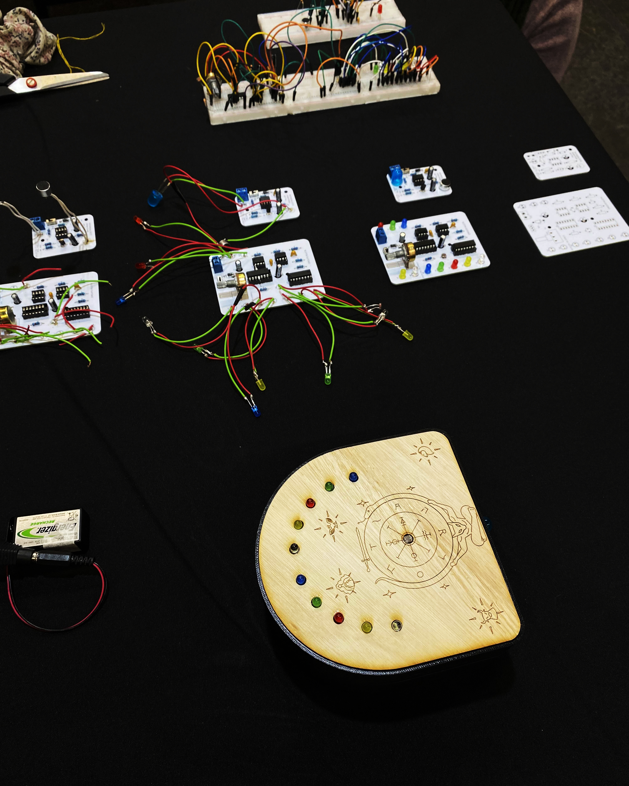

