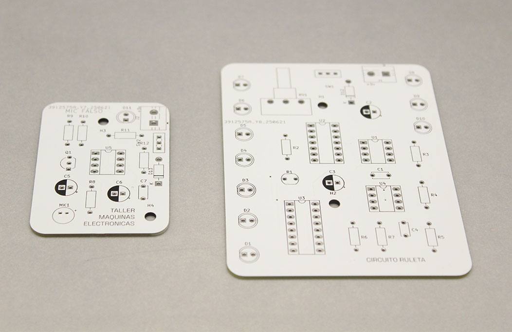
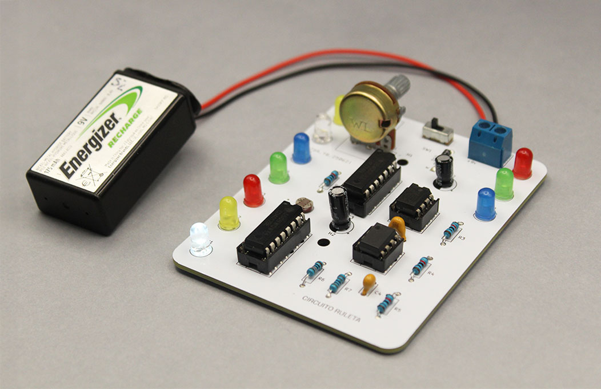
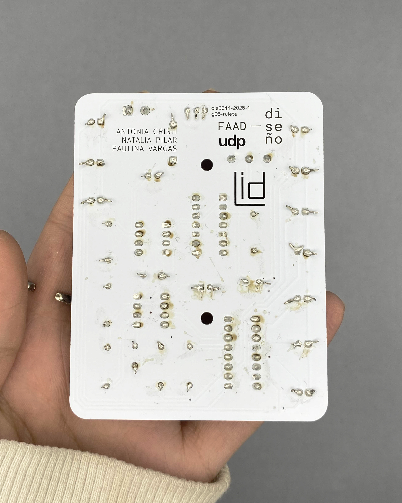
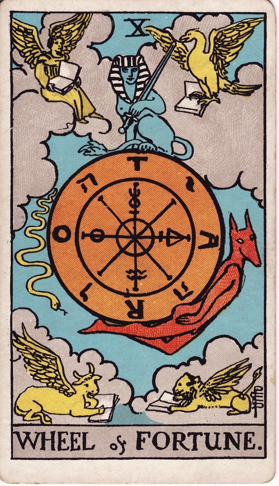
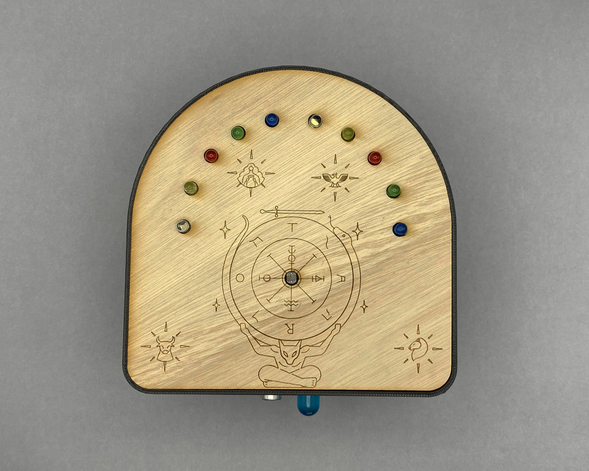

# examen

grupo-05

## integrantes
  - Antonia Cristi [@antocristi](https://github.com/antocristi)
  - Natalia Pilar [@sz-mada](https://github.com/sz-mada)
  - Paulina Vargas [@paulinavargasf](https://github.com/paulinavargasf)

## proyecto-02

### aprendizajes

Pedir ayuda a gente externa al equipo de trabajo, organizarnos en estaciones de trabajo para facilitar el avance durante el día.

### dificultades

El circuito de la ruleta en las placas no funcionaba como se esperaba.

Los cables para soldar los componentes colgantes se cortaban constantemente a la altura de la placa.

Se nos olvidó quitar un chip al momento de soldar y lo quemamos, pero conseguimos darnos cuenta y cambiarlo.

El circuito no recibía el input del LDR.

[FranUDP](https://github.com/FranUDP) y Aarón nos ayudaron a darnos cuenta que el chip LM324 no lo habíamos conectado a tierra ni VCC en el esquemático, así que en la placa final tampoco estaba conectado.

Aarón nos sugirió como solución conectar los pines 4 y 11 externamente a la alimentación de la placa, tristemente no resolvió el problema.

## PCB

El proyecto consiste en dos circuitos paralelos con sus respectivas PCBs; el primer circuito consiste en un detector de sombra que, por medio de un LDR, activa una secuencia de 10 pasos de LEDs, y el segundo es un micrófono electret que enciende una luz LED por medio del input de sonido. Estos circuitos **no** están relacionados en funcionalidad; el circuito del micrófono solo es un truco para el usuario.

Imágenes de las protoboards de prototipado

Imágenes de las placas PCB

## soldadura

Decidimos soldar las placas a lo largo de distintos días.

Inicialmente, soldamos una de cada placa con todos los componentes directo en estas para asegurarnos que todo funcionara como debía.

Luego, en las otras placas, soldamos cables hacia los LEDs y el LDR para poder montarlos en la carcasa, pero tuvimos problemas ya que estos cables tendían a cortarse muy fácilmente.

Finalmente, luego de terminar de soldar y arreglar los cables cortados, montamos las placas correspondientes a la carcasa.

## carcasa

La carcasa se construyó en dos partes: una tapa hecha en corte láser con terciado de 3mm, y el contendor en impresión 3D.

Las luces LED de la ruleta se colocaron en la parte superior de la tapa en forma de arco, y el LDR fue situado en el centro para ser accesible al usuario.

Antes de cortar la tapa, decidimos agregar un diseño inspirado por una de las cartas del tarot, la rueda de la fortuna, con el centro de esta rueda alineándose con el posicionamiento del LDR.

Imágenes de la carcasa

## montaje
