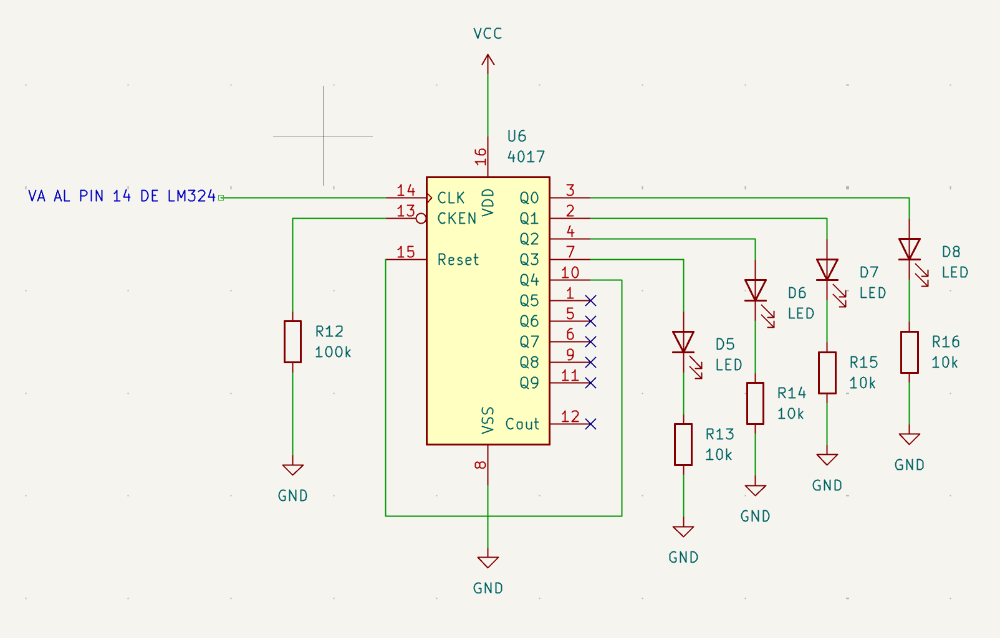
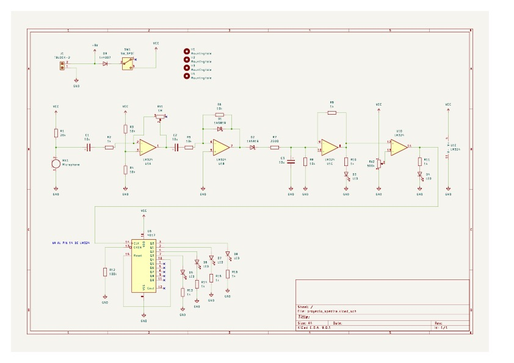

# sesion-15a

17-06-2025

## Esquemático

- En esta clase, logramos que funcionara el circuito con ayuda de Matías y Ángel, quienes lograron hacer el esquemático del micrófono con el Chip LM324 para poder regular la sensibilidad de este (nos había faltado un condensador de 1 uF en el pin 1), luego desde el pin 14 del chip LM324 poder conectarlo al pin 14 del Chip 4017 y que funcionen las luces.
- En esta clase nos dedicamos a resolver de mejor manera el circuito y organizar todas las cosas que se solicitaron para el encargo.

## BOM 

| Componente    | Cantidad | Comentarios     |
| ------------- | -------- | --------------- |
| Resistencia   | 8        | 1k              |
| Resistencia   | 4        | 10k             |
| Resistencia   | 1        | 220             |
| Resistencia   | 2        | 22k             |
| Micrófono     | 1        | CZN-15E         |
| Condensador   | 2        | 10uF            |
| Condensador   | 1        | 1uF             |
| Diodo         | 2        | 1n5819          |
| Diodo         | 1        | 1n4007          |
| Potenciómetro | 1        | 1M Ohm          |
| Potenciómetro | 1        | 500k            |
| LED           | 8        | 10mm            |
| LED           | 2        | 5mm             |
| Chip          | 1        | LM324N          |
| Chip          | 1        | 4017            |
| Terminal block | 1        | 2 pin          |
| Switch        | 1        | spdt            |
| Bateria        | 1        | 9v             | 

- Como grupo decidimos que los LEDS de 10mm son de **colores variados** y los LEDS de 5mm uno es de **color verde y otro blanco.**

### Registro

- Grupo de registro tomó fotos de el prototipado en protoboard y aprovechamos de grabar unos videos.

